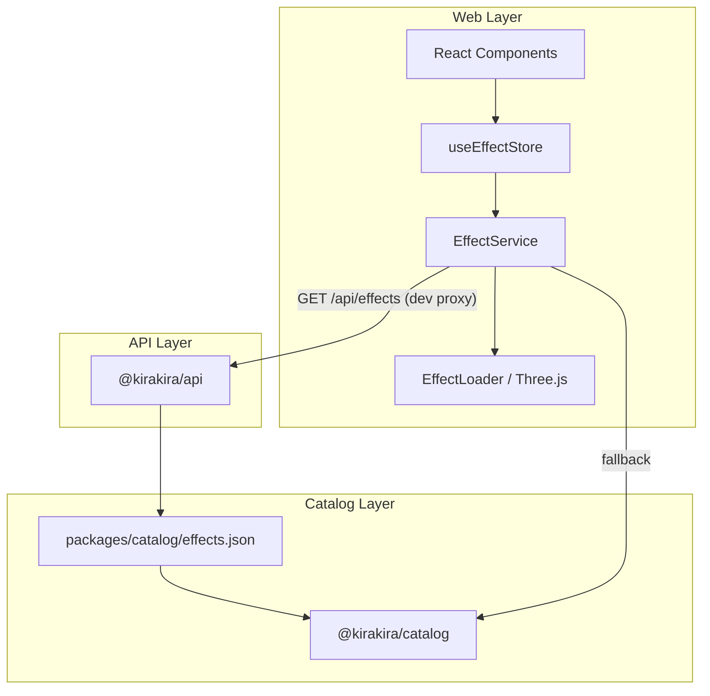

# Kirakira Architecture

Monorepo layout for the Gundam Effects Viewer. Boundaries are enforced by package dependencies, not folder convention alone.

## Package Map

```
kirakira/
├── packages/
│   ├── contracts/     @kirakira/contracts   Shared DTOs (Effect, ApiResponse)
│   ├── catalog/       @kirakira/catalog     effects.json + typed export
│   └── effect-sdk/    @kirakira/effect-sdk  Three.js runtime contract
├── apps/
│   ├── web/           @kirakira/web          React + Vite SPA
│   └── api/           @kirakira/api          Express REST API
├── docs/              Human architecture guides
└── design-plan/       Product & design specs
```

## Dependency Rules

| Package | May depend on | Must NOT depend on |
|---------|---------------|-------------------|
| `@kirakira/contracts` | — | react, three, express |
| `@kirakira/catalog` | contracts | react, three, express |
| `@kirakira/effect-sdk` | three (peer) | react, express |
| `@kirakira/web` | contracts, catalog, effect-sdk | api internals |
| `@kirakira/api` | contracts, catalog | react, three, web src |

## Runtime Data Flow



## Web App Layers (`apps/web/src`)

| Layer | Responsibility |
|-------|----------------|
| `components/` | Presentation (ui, layout, effects, common) |
| `store/` | Zustand global state (uiStore, effectStore) |
| `services/` | EffectService, apiClient — side effects & I/O |
| `effects/` | Three.js effect modules + loader (uses `@kirakira/effect-sdk`) |
| `hooks/` | React composition |
| `types/` | Frontend-only types; re-exports `@kirakira/contracts` |

**Effect module contract** (runtime): `@kirakira/effect-sdk` — `EffectModule` with `init` / `update` / `dispose`.  
**Catalog DTO**: `@kirakira/contracts` — `Effect`, `EffectParameter` (not the same as `EffectModule`).

## Development Commands

```bash
npm install              # root — installs all workspaces
npm run dev              # web @ :5173 (proxies /api → :3001)
npm run dev:api          # api @ :3001
npm run verify           # type-check all + lint/test web+api + builds
```

## API CORS

`@kirakira/api` allows only whitelisted browser origins (`apps/api/src/lib/cors.ts`).

- **Dev default:** `http://localhost:5173`, `http://127.0.0.1:5173`
- **Production:** set `CORS_ORIGINS` (comma-separated), e.g. `https://kirakira.example.com`

## Catalog Ownership

`effects.json` lives in **`packages/catalog/`** — single source of truth.  
API reads from `packages/catalog/effects.json`. Web imports `@kirakira/catalog` as offline fallback.

## State Management

- UI: `useUIStore` (Zustand) only
- Effects: `useEffectStore` (Zustand) only
- No React Context for application state

## Adding a Package

1. Create under `packages/` or `apps/`
2. Add workspace dependency: `"@kirakira/contracts": "*"`
3. Update this document and `AGENTS.md`
4. Run `npm run verify`
